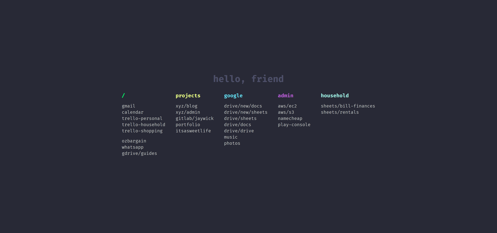

## Preview



## Releases

- Firefox: https://addons.mozilla.org/en-US/firefox/addon/hello-friend-new-tab/
- Chrome: https://chrome.google.com/webstore/detail/hello-friend/aehibelbdjcoffckialjmnilfimajain

## Notes

- In Firefox you'll have to manually set the home page.
  - Check the console for the URL in a new Hello, Stitch tab
- In Chrome remove the `applications` object in the `manifest.json` this is Firefox only

## Roadmap / Contributions

See https://github.com/mdial009/hello-stitch/issues

## Local development

Clone the source

    git clone git@github.com:mdial009/hello-stitch.git

Firefox

1. Go to `about:debugging` in address bar
2. Click _Load Temporary Add-on_ button on top right
3. Open any file at root directory of this extension's source

Chrome

1. Go to `chrome://extensions/` in address bar
2. Tick _Developer mode_ toggle at top right
3. Click _Load Unpacked_
4. Choose the directory of this extension's source code


### Additional Notes

*Styles*: All CSS has been pulled out of the HTML file and now lives in `styles.css`. This keeps markup clean and makes layout tweaks simpler.

*Tests*: A lightweight test script lives under `tests/utils.test.js`. It exercises several helpers and can be run with Node:

```bash
node tests/utils.test.js
```

It will print `utils tests passed` if everything is working correctly.

